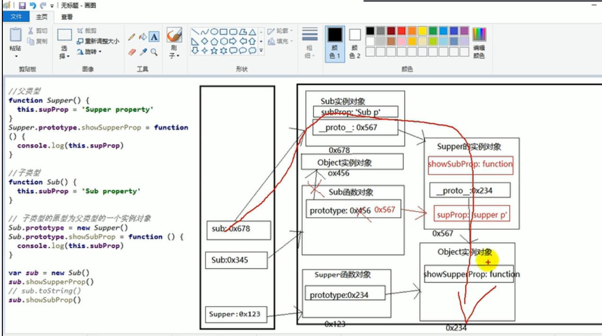

## 对象的继承 实际上就是原型链的继承


## 方式一
```js
<script>
// 1. 原型链继承
//    1. 套路
//       1. 定义父类型构造函数
//       2. 给父类型的原型添加方法
//       3. 定义子类型构造函数
//       4. 创建父类型的对象赋值给子类型的原型
//       5. 将子类型原型的构造属性设置为子类型
//       6. 给子类型原型添加方法
//       7. 创建子类型的对象：可以调用父类型的方法
//    2. 关键
//       1. 子类型的原型为父类型的一个实例对象

// 父类型
function Supper(){
    this.subProp = 'Supper property'
}
Supper.prototype.showSupperProp = function(){
    console.log(this.subProp);
}

// 子类型
function Sub(){
    this.subProp = 'Sub property'
}

// 子类型的原型为父类型的一个实例对象
Sub.prototype = new Supper()
Sub.prototype.showSubProp = function(){
    console.log(this.subProp);
}
var sub = new Sub()
sub.showSupperProp()
// toString是属于Object原型上的一个方法。
// sub.toString()
sub.showSubProp()

</script>
```

## 方式二
```js
<script>
// 方式二
// 借用构造函数继承（假的）
// 1. 套路：
//    1. 定义父类型构造函数
//    2. 定义子类型构造函数
//    3. 在子类型构造函数中调用父类型构造
// 2. 关键
//    1. 在子类型构造函数中通用call（）调用父类型构造函数

function Person(name,age){
    this.name = name
    this,age = age
}
function Student(name,age,price){
    // 相当于：this.Person(name,age)
    Person.call(this,name,age){
        // this.name = name
        // this.age = age
        this.price = price
    }
}
var s = new Student('tom',11,12)


</script>
```

## 方式三 原型链＋借用构造函数的组合继承
```js
<script>
//     1. 利用原型链实现对父类型对象的方法继承
//      2. 利用super（）借用父类型构建函数初始化相同属性
function Person(name,age){
    this.name = name
    this,age = age
}
Person.prototype.setName = function(name){
    this.name = name
}
function Student(name,age,price){
    // 为了得到属性
    Person.call(this,name,age){
        this.price = price
    }
}
// 为了能看到父类型的方法
Student.prototype = new Person()
// 修正constructor属性
Student.prototype.constructor = Student
Student.prototype.setPrice = function(price){
    this.price = price
}
 var s = new Student('tom',23,00009)
 s.setName('ooo')
 s.setPrice(11110000)

</script>
```

## call函数
1. call 函数的用法：

    1. call() 函数中的第一个参数表示：想让 this 指向的对象 (obj)；
    1. call() 函数中的第二及以后参数表示：传进去的实参；

2. call 函数的功能：

    1. 让函数立执行；
    1. 可改变 this 的指向；
    1. 可实现继承问题；