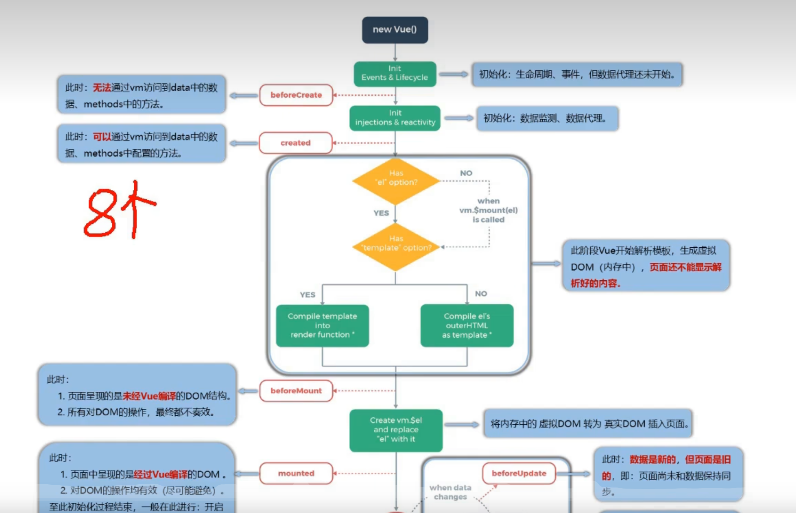
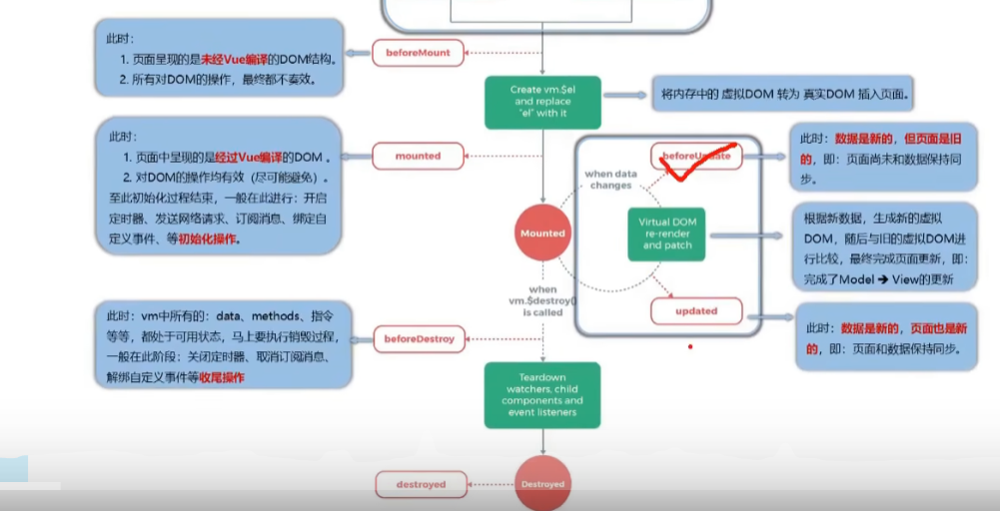
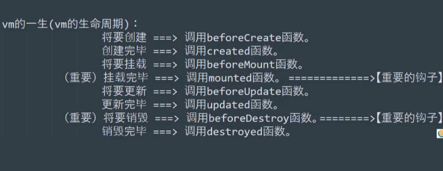

## 生命周期
1. 又名：生命周期回调函数，生命周期函数，生命周期钩子
2. 是什么：vue在关键时刻帮我们调用的一些特殊名称函数
3. 生命周期函数的名字不可更改，但函数的具体内容是程序员根据需要编写的
4. 生命周期函数中的this指向是vm或组件实例对象
```html
<body>
    <div id="root">
        <h2 style="opacity: 1;">hhhh</h2>
        <h2 :style="{opacity:opacity}"></h2>
        <h2 :style="{opacity}"></h2>
    </div>
</body>
<script>
     const vm = new Vue({
        el:'#root',
        data:{
            opacity:1
        },
        mounted() {
            setInterval(()=>{
        this.opacity -= 0.01
        // 因为js对小数点不是很精确 所以不用等于0 而是替换成小于等于
        if(this.opacity <= 0) this.opacity = 1
    })
        },
     })
    setInterval(()=>{
        vm.opacity -= 0.01
        // 因为js对小数点不是很精确 所以不用等于0 而是替换成小于等于
        if(vm.opacity <= 0) vm.opacity = 1
    })
</script>

```

# 总结
1. 常用的生命周期钩子
   1. mounted：发送ajax请求，启动定时器，绑定自定义事件，订阅消息等（初始化操作）
   2. beforeDestroy：清除定时器，解绑自定义事件，取消订阅消息（收尾工作）
2. 关于销毁vue实例
   1. 销毁后借助vue开发者工具看不到任何消息
   2. 销毁后自定义事件会失效，但原生dom事件依然有效
   3. 一般不会在beforeDestroy操作数据，因为即便操作数据，也不会再触发更新流程了



```html
<body>
    <div id="root">
        <h2 style="opacity: 1;">hhhh</h2>
        <button @click="opacity = 1">透明度设置为1</button>
        <button @click="stop">点我停止变换</button>
    </div>
</body>
<script>
     const vm = new Vue({
        el:'#root',
        data:{
            opacity:1
        },
        methods: {
            stop(){
                this.$destroy()
            }
        },
        mounted() {
            this.timer = setInterval(()=>{
                this.opacity -= 0.01
                if(this.opacity <= 0) this.opacity = 1
            },16)
        },
        beforeDestroy() {
            console.log('vm要被销毁了');
            clearInterval(this.timer)
        },
    })
</script>

```
