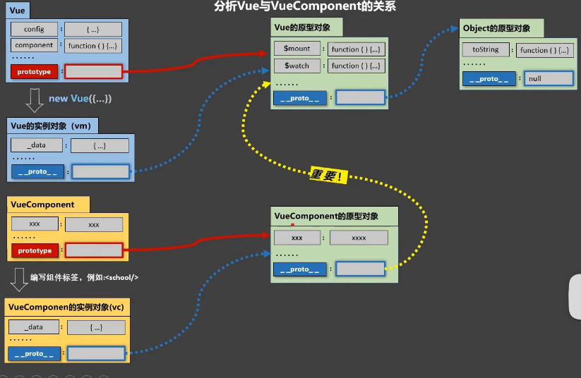

## 关于VueComponent
1. school组件本质是一个名为VueComponent的构造函数，且不是程序员定义的，是Vue.extend生成的
2. 我们只需要写组件名标签，Vue解析时会帮我们创建school组件的实例对象，即Vue帮我们执行的 new VueComponent(options)
3. 特别注意：每次调用Vue.extend都是返回一个全新的VueComponent
4. 关于this指向
   1. 组件配置中
      1. data函数，methods中的函数，watch中的函数this都是VueComponent
   2. new vue配置
      1. data函数，methods中的函数，watch中的函数this都是Vue实例对象
5. VueComponent简称vc，组件实例对象
6. 一个重要的内置关系：VueComponent.prototype.__proto__ === Vue.prototype
7. 为什么有这个关系是为了让组件实例对象vc可以访问到vue原型上的属性，方法
