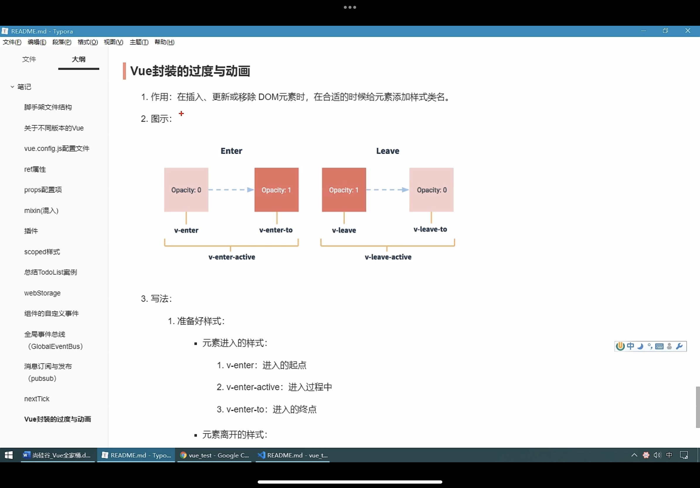

# Vue封装的过渡与动画
1. 作用:在插入,更新或移除DOM元素时,在合适的时候给元素添加样式类名
2. 
3. 写法
   1. 准备好样式 也可以单纯使用动画写 就只使用active ,配合的就是过渡➕动画
      1. 元素进入的样式
         1. v-enter:进入的起点
         2. v-enter-active:进入过程中
         3. v-enter-to:进入的终点
      2. 元素离开的样式
         1. v-leave:离开的起点
         2. v-leave-active:离开过程中
         3. v-leave-to:离开的终点
   2. 使用trasition包裹过渡的元素,并配置name属性
      <transition name='hello'>
        <h1 v-show='isshow'>hello</h1>
      </transition> 
    3. 多个元素使用transition-group,每个元素都要key

```html
<!-- test 使用css3 写动画和过渡 -->
<template>
  <div class="student">
    <button @click="isShow = !isShow">显示/隐藏</button>
    <transition appear>
      <h1 v-show="isShow">hello</h1>
    </transition>
  </div>
</template>

<script>
export default {
  name: "Student",
  props: {
    msg: String,
  },
  data() {
    return {
      isShow: false,
    };
  },
};
</script>

<!-- Add "scoped" attribute to limit CSS to this component only -->
<style scoped>
h1 {
  background-color: #42b983;
}
.v-enter-active {
  animation: kary 1s;
}
.v-leave-active {
  animation: kary 1s reverse;
}
@keyframes kary {
  from {
    transform: translateX(-100%);
  }
  to {
    transform: translateX(0px);
  }
}
</style>

<!-- test1 使用vue封装的 -->
<template>
  <div class="student">
    <button @click="isShow = !isShow">显示/隐藏</button>
    <transition-group name="hello" appear>
      <h1 v-show="isShow" key="1">hello</h1>
      <h1 v-show="isShow" key="2">kary</h1>
    </transition-group>
  </div>
</template>

<script>
export default {
  name: "test",
  props: {
    msg: String,
  },
  data() {
    return {
      isShow: false,
    };
  },
};
</script>

<!-- Add "scoped" attribute to limit CSS to this component only -->
<style scoped>
h1 {
  background-color: #42b983;
  /* transition: 0.5s linear; */
}
/* 进入的起点 */
.hello-enter{
  transform: translateX(-100%);
}
/* 进入的终点 */
.hello-enter-to{
  transform: translateX(0);
}
/* 过程中 */
.hello-enter-active,.hello-leave-active{
    transition: 0.5s linear;
}
/* 离开的起点 */
.hello-leave{
  transform: translateX(0%);
}
/* 离开的终点 */
.hello-leave-to{
  transform: translateX(-100%);
}


</style>

<!-- 使用animate插件 -->
<template>
  <div class="student">
    <button @click="isShow = !isShow">显示/隐藏</button>
    <transition-group 
    appear
    name="animate__animated animate__bounce"
    enter-active-class="animate__swing"
    leave-active-class="animate__backOutUp"
    >
      <h1 v-show="!isShow" key="1">hello</h1>
      <h1 v-show="isShow" key="2">xxx</h1>
    </transition-group>
  </div>
</template>

<script>
import 'animate.css'
export default {
  name: "test1",
  props: {
    msg: String,
  },
  data() {
    return {
      isShow: false,
    };
  },
};
</script>

<!-- Add "scoped" attribute to limit CSS to this component only -->
<style scoped>
h1 {
  background-color: #42b983;
  /* transition: 0.5s linear; */
}


</style>
```