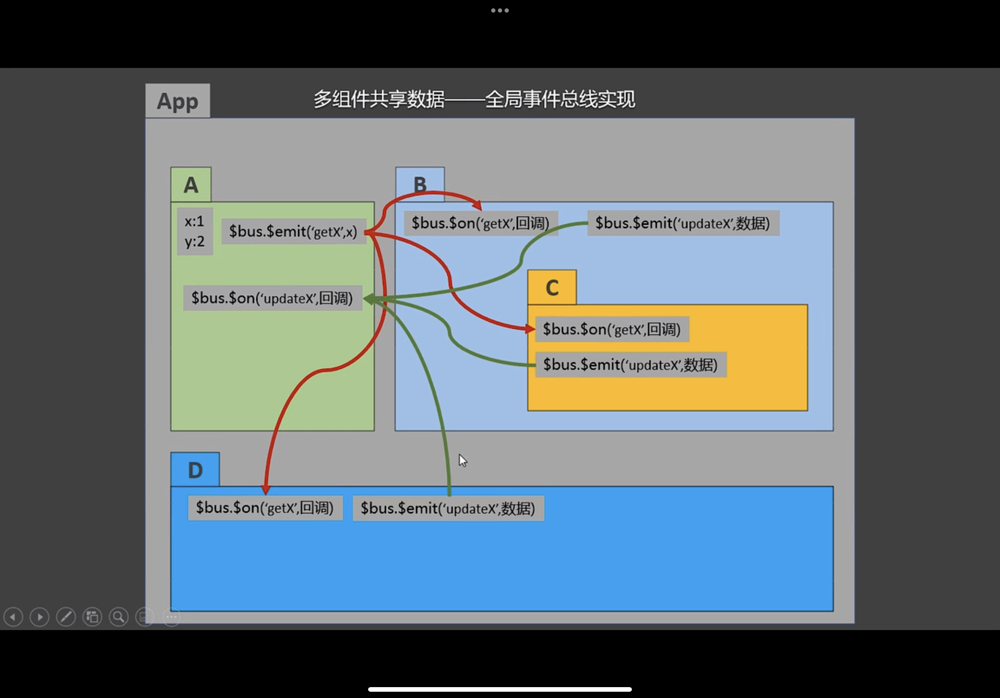
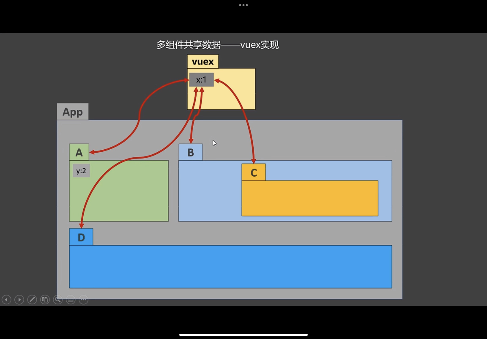

## vuex
1. 专门在vue中实现集中式状态(数据)管理的一个Vue插件,对vue应用中多个组件的共享状态进行集中式的管理(读/写),也是一种组件间通信的方式,且适用于任意组件间通信
2. 全局事件和vuex处理多组件数据共享图解
   1. 绿色的是改变a里面的数据
   2. 红色的是把数据传给绿色
   
   3. 双向箭头 会给api可以去修改
   
3. 什么时候用
   1. 多个组件依赖于同一状态(数据)
   2. 来自不同组件的行为需要变更为同一状态 

##  使用vuex
1. npm i vuex vue2和vue3使用的vuex版本不一样
2. Vue.use(Vuex)
3. store
4. vc ==> store

```html
<!-- main.js -->
import Vue from 'vue'
import App from './App.vue'

// 引入vuex 因为在使用store之前就要有vuex 但是import 不按照顺序 都是先把import运行
// import Vuex from 'vuex'
// Vue.use(Vuex)
// 引入store 如果有index可以不用写到index那一层
import store from './store/index'
Vue.config.productionTip = false

new Vue({
  render: h => h(App),
  store
}).$mount('#app')

<!-- store/index.js -->
import Vuex from 'vuex'
// 该文件用来创建vuex中最核心的store
// 准备actions 用于响应组件中的动作
// 业务逻辑写这里
const actions = {
    jia: function (context, value) {
        context.commit('JIA', value)
    },
    jian(context, value) {
        context.commit('JIAN', value)
    },
    <!-- 为什么要把上下文给你 只给一个commit不就可以吗 但是如果在action这里要处理的逻辑太多呢 -->
    jiaOdd(context, value) {
        if (context.state.sum % 2) {
            context.commit('JIA', value)
        }
    },
    <!-- 例如像下面的 至于为什么要给state 如果数据都不给你 怎么做逻辑的判断 -->
    jiaOdd(context, value) {
        <!-- 就可以在逻辑里面套了 -->
        context.dispatch('demo1',value)
    },
    demo1(context,value){
        context.dispatch('demo2',value)
    },
    demo2(context,value){
        context.commite('JIA',value)
    }
    <!-- 为什么都做完逻辑判断不在这里面处理数据 而是又要调用其他的mutation  -->
    jiaWait(context,value){
        setTimeout(()=>{
            context.commit('JIA',value)
        })
    }
}
// 准备 mutations 用于操作数据(state)
const mutations = {
    JIA(state, value) {
        state.sum += value
    },
    JIAN(state, value) {
        state.sum -= value
    }
}
// 准备state 用于存储数据
const state = {
    sum: 0//当前和
}
import Vuex from 'vuex'
Vue.use(Vuex)

// 创建store
export default new Vuex.Store({
    actions,
    mutations,
    state
})

// 暴露store 导出

<!-- 使用 components-->
<template>
    <div>
        <h1>当前求和为:{{$store.data.sum}}</h1>
        <select v-model.number="n">
            <!-- 因为value值绑定的不是: 所以是字符串会拼串 可以model加number修饰符-->
            <option value="1">1</option>
            <option value="2">2</option>
            <option value="3">3</option>
        </select>
        <button @click="increment">+</button>
        <button @click="decrement">-</button>
        <button @click="incrementOdd">当前求和为奇数再加</button>
        <button @click="incrementWait">等一等再加</button>
    </div>
</template>

<script>
export default {
    name:'Count',
    data(){
        return{
            n:1,//用户选择的数字
            

        }
    },
    methods:{
        increment(){
            // action没有他要的业务逻辑
            this.$store.commit('jia',this.n)
        },
        decrement(){
            this.$store.commit('jian',this.n)
        },
        incrementOdd(){
            this.$store.dispatch('jia',this.n)
        },
        incrementWait(){
            this.$store.dispatch('jia',this.n)
        }
    },
    mounted(){

    }
}
</script>

<style scoped>
button{
    margin-left: 5px;
}
</style>
```
